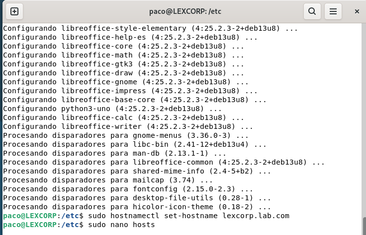
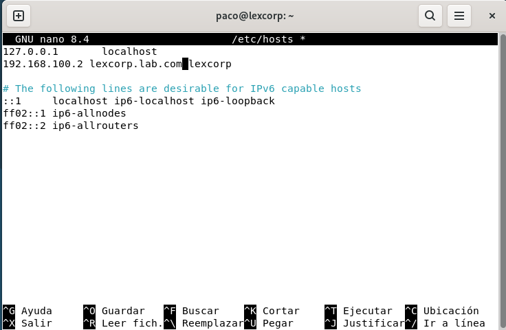
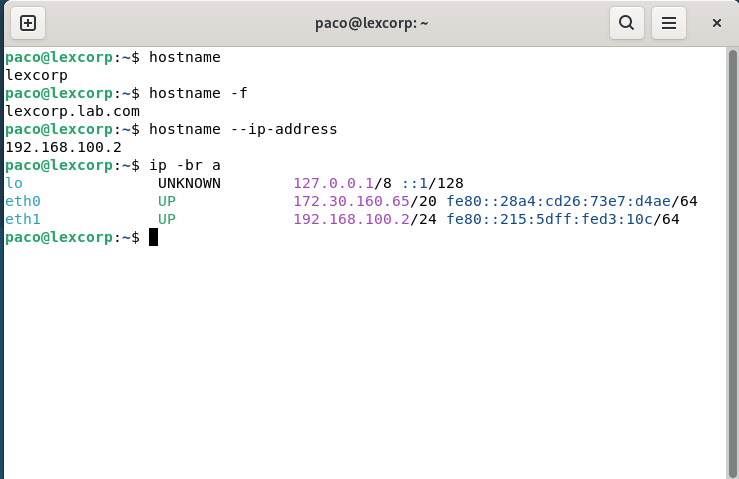
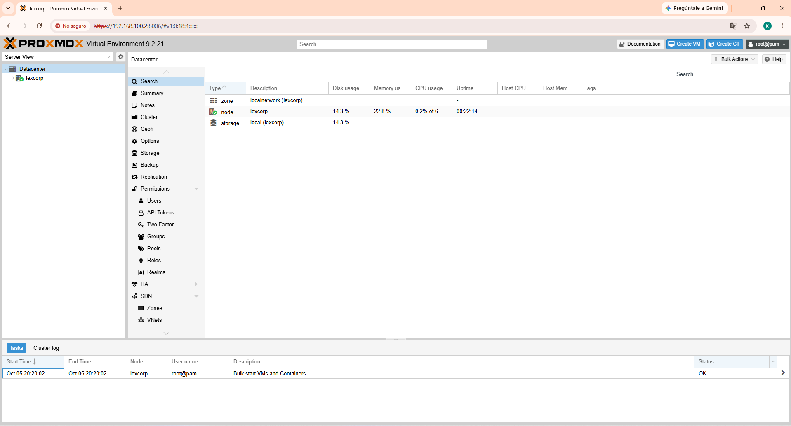

# Instalacion Proxmox VE

Proxmox Virtual Environment (Proxmox VE) es una plataforma de virtualización de servidores de código abierto
que permite administrar máquinas virtuales y contenedores desde una única interfaz web

## Objetivos
- Habilitar la virtualización anidada en Hyper-V
- Configurar hostname y dominio
- Instalar el repositorio y el kernel de Proxmox VE
- Acceder a la interfaz web de Proxmox

## Paso 1: Actualizar el sistema
```
sudo apt update && sudo apt full-upgrade -y
```
## Paso 2: Hostname y dominio
```
sudo hostnamectl set-hostname lexcorp.lab.com
```

El anterior comando se encarga de establecer un nombre de host para nuestro ambiente.
Ahora procedemos a colocar la direccion IP, ene ste caso contamos con 2 adptadores de red, uno por DHCP encargado
de darnos internet y el otro se muestra estatico
```
sudo nano /etc/hosts
```
Quedaria asi:


Para confirmar que se asigno todo correctamente hacemos uso de los siguientes comandos:
```
hostname ##Nos debe arrojar solo el nombre de la maquina siendo en este caso "lexcorp"
hostname -f ##Este comando de todo estar correcto nos mostrara el nombre completo del dominio, siguiendo mi ejemplo seria "lexcorp.lab.com"
hostname --ip-address ##Este comando nos entrega la direccion IP del host la cual no puede ser la misma que nuestro localhost, usamos la IP estatica
ip -br a ##Por ultimo este comando nos confirma que coincidan las IP
```


## Paso 3: Repositorio de proxmox

El orden importa: primero se instala el kernel de Proxmox y después el paquete principal. 
```
apt update && apt full-upgrade -y

wget https://enterprise.proxmox.com/debian/proxmox-archive-keyring-trixie.gpg \
  -O /usr/share/keyrings/proxmox-archive-keyring.gpg

cat > /etc/apt/sources.list.d/pve-install-repo.sources <<'EOF'
Types: deb
URIs: http://download.proxmox.com/debian/pve
Suites: trixie
Components: pve-no-subscription
Signed-By: /usr/share/keyrings/proxmox-archive-keyring.gpg
EOF

apt update
```
## Paso 4: Kernel de proxmox
Ya con el repositorio de proxmox en nuestro equipo procederemos a instalar el kernel de proxmox
```
apt install proxmox-default-kernel -y
reboot
```
Reiniciamos para confirmar que todos nuestros cambios se aplicaron
Una vez terminado el reboot procedemos a instalar proxmox VE
```
apt install proxmox-ve postfix open-iscsi chrony -y
```
Nos preguntara como deseamos hacer uso de postfix, por fines de este laboratorio lo dejaremos en "Local Only" ya que no haremos uso de correo
Una vez terminado de instalar el proxmox-ve removemos el kernel de debian y colocamos el de proxmox:
```
sudo apt remove linux-image-amd64 'linux-image-6.12*'
sudo update-grub
sudo reboot
```
## Paso 5: Virtualizacion Anidada:
Con la maquina virtual apagada dentro de una consola de powershell abierta como administrador hacemos uso de:
```
Set-VMNetworkAdapter -VMName "LEXCORP" -MacAddressSpoofing On
Set-VMProcessor -VMName LEXCORP -ExposeVirtualizationExtensions $true
```
Esto nos permitira la virtualizacion anidada y permitir el trafico de las mv  por la tarjeta de la MV
Al final buscamos:
"https://direccion_ip:8006"
Nos saldra una alerta de privacidad, damos en avanzar y nos aparecera el inicio de sesion para ingresar a proxmox, son las mismas credenciales de nuestra MV.

